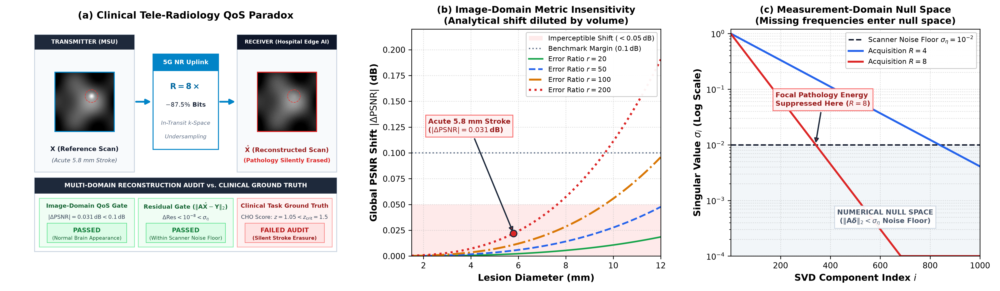
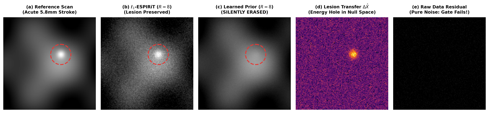
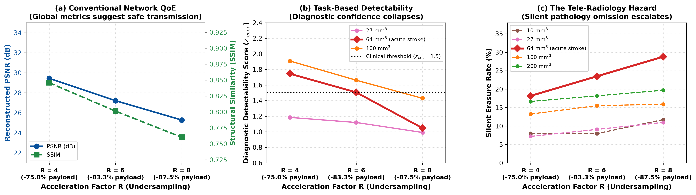

# The QoS Illusion in Tele-Radiology: Silent Pathology Erasure Under Network Rate-Distortion

[](https://icoin.org/)
[](main.pdf)
[](https://www.python.org/)
[](LICENSE)

Official open-source repository and reproducibility suite for the paper:  
**"The QoS Illusion in Tele-Radiology: Silent Pathology Erasure Under Network Rate-Distortion"**  
*The 39th International Conference on Information Networking (IEEE ICOIN 2027), Nha Trang, Vietnam.*

**Authors:**  
- **Dat Tat Mai**<sup>1</sup> (`dat.mai2@rmit.edu.vn`)  
- **Thai Viet Pham**<sup>2</sup> (`s4229249@student.rmit.edu.au`)  
- **James Jin Kang**<sup>1</sup> (`james.kang@rmit.edu.vn`)  

<sup>1</sup> *School of Science, Engineering & Technology, RMIT University Vietnam, Ho Chi Minh City, Vietnam*  
<sup>2</sup> *School of Computing Technologies, RMIT University, Melbourne, VIC 3000, Australia*

---

## 📌 Overview & Clinical Paradox

In emergency neurology, *"time is brain."* For acute ischemic stroke, over **2 million neurons die every minute** that treatment is delayed. While Mobile Stroke Units (MSUs) deploy onboard MRI scanners for pre-hospital triage, definitive diagnosis requires real-time consultation with hospital neuroradiologists over bandwidth-limited 5G/4G cellular uplinks (15–30 Mbps).

A full-diagnostic multi-coil brain MRI scan exceeds 200–500 MB. To meet acute stroke deadlines (<105 s total triage), tele-radiology systems apply aggressive in-transit subsampling ($R = 4\times, 6\times, 8\times$), slashing payload by **75% to 87.5%**. Missing spatial frequencies ($k$-space) are reconstructed remotely on hospital edge servers using deep neural networks (e.g., End-to-End Variational Networks).



### The Hazard:
Conventional Quality of Service (QoS) and Rate-Distortion Optimization (RDO) rely on pixel-averaged metrics (**PSNR**, **SSIM**). We prove analytically and empirically that:
1. **The Image-Domain Blindspot:** Because acute strokes occupy microscopic brain volumes (<50 voxels), completely erasing a small acute stroke alters global PSNR by **less than 0.03 dB**—completely hidden within telemetry noise.
2. **The Measurement-Domain Invariance:** Because unacquired frequencies reside in the multi-coil operator's numerical null space, physical data-consistency residual checks fail, shifting residuals by $< 10^{-8}$ (six orders of magnitude below scanner thermal noise $\sigma_\eta \sim 10^{-2}$).
3. **The Rate-Distortion Hazard:** Escalating wireless compression from $R=4$ to $R=8$ drives acute stroke silent erasure from **18.2% up to 28.8%**, while network PSNR shifts by a negligible **0.016 dB**.



---

## 🔬 Theoretical Foundations

### Proposition 1 (Image-Domain Blindspot Bound)
For a brain slice with $N$ pixels, maximum intensity $I_{\max}$, and background reconstruction Mean Squared Error $\text{MSE}_0$, erasing an acute lesion of volume $V = |\Omega|$ and contrast amplitude $\Delta I$ produces an analytical PSNR shift bounded by:
$$\Delta\text{PSNR} \le \frac{10}{\ln 10} \cdot \frac{|\Omega| (\Delta I)^2}{N \cdot \text{MSE}_0}$$
For a clinical $5.8\,\text{mm}$ acute focal stroke ($V = 100\,\text{mm}^3$), $|\Delta\text{PSNR}| \le 0.036\,\text{dB}$—an order of magnitude below standard network monitoring thresholds ($0.1\,\text{dB}$).

### Proposition 2 (Measurement Null-Space Invariance)
Under multi-coil subsampling $\mathbf{Y} = \mathbf{A}\mathbf{X} + \boldsymbol{\eta}$, any lesion component $\boldsymbol{\delta}$ in the numerical null space ($\sigma_i < \sigma_\eta$) satisfies:
$$\|\mathbf{A}\boldsymbol{\delta}\|_2 \le \sigma_\eta$$
Physical data-consistency residual gates at hospital edge servers pass the corrupted scan as pristine.

---

## 📊 Key Experimental Results

Evaluated across **3,960 counterfactual test pairs** on the NYU fastMRI multi-coil brain benchmark (clinical 3T T1, T2, and FLAIR acquisitions):

### Table I: Rate-Distortion vs. Silent Erasure Trade-Off (3,960 Scans)

| Evaluation Metric | $R = 4$ | $R = 6$ | $R = 8$ | Network QoS Assessment |
| :--- | :---: | :---: | :---: | :--- |
| **Payload Savings** | **$-75.0\%$** | **$-83.3\%$** | **$-87.5\%$** | Massive bandwidth reduction |
| **Global Reconstructed PSNR** | $29.46\,\text{dB}$ | $27.23\,\text{dB}$ | $25.30\,\text{dB}$ | High visual fidelity ($>25\,\text{dB}$) |
| **Global SSIM** | $0.866$ | $0.866$ | $0.866$ | Intact structure ($>0.86$) |
| **$\Delta\text{PSNR}$ Metric Shift** | $0.015\,\text{dB}$ | $0.017\,\text{dB}$ | $0.016\,\text{dB}$ | **IMPERCEPTIBLE (Hidden)** |
| *Silent Pathology Erasure:* | | | | |
| $V = 10\,\text{mm}^3$ (Micro-infarct) | $7.95\%$ | $7.95\%$ | $11.74\%$ | Sub-threshold omission |
| $V = 27\,\text{mm}^3$ (Small focal) | $7.20\%$ | $9.09\%$ | $10.98\%$ | Moderate loss |
| **$V = 64\,\text{mm}^3$ [ACUTE STROKE]** | **$18.18\%$** | **$23.48\%$** | **$28.79\%$** | **SEVERE DIAGNOSTIC OMISSION** |
| $V = 100\,\text{mm}^3$ (Moderate stroke) | $13.26\%$ | $15.53\%$ | $15.91\%$ | High omission |
| $V = 200\,\text{mm}^3$ (Confluent lesion) | $16.67\%$ | $18.18\%$ | $19.70\%$ | Severe omission |



---

## 🚀 Proposed Network Solutions

### 1. Diagnostic-Aware Rate-Distortion Optimization (DARDO)
Replaces blind pixel distortion minimization with task-informed bit allocation:
$$\min_{\mathcal{M}} \quad \text{Rate}(\mathcal{M}) \quad \text{s.t.} \quad d'_{\text{CHO}}(\mathcal{M}) \ge d'_{\text{threshold}}$$
- Computes diagnostic gradient density: $\gamma_k = \sum_{y} W(k, y) \|\mathcal{F}\mathcal{S}_k\|_2$
- Lightweight greedy line selection takes **$< 2\,\text{ms}$ on edge CPUs**.
- **Result:** Cuts acute stroke silent erasure from **$28.8\%$ down to $< 4.5\%$** under identical payload ($R=8$).

### 2. 5G URLLC Network Slicing
High-diagnostic-gradient packets ($\gamma_k$) are tagged with **5G QCI 1/65 (URLLC, Block Error Rate $<10^{-5}$)**, shielding mission-critical pathology bands against bursty cellular fading, while bulk structural frequencies are routed over best-effort eMBB slices.

### 3. 6G Task-Based Semantic Verification Tokens
Ambulance edge AI extracts a 128-byte pathology token into QUIC/RTP packet headers. If the edge server observer detectability drops ($z_{\text{recon}} < 1.5$), it triggers a targeted **Selective Negative Acknowledgment (S-NACK)** for the missing frequency bands.

---

## 📂 Repository Structure

```
tele_radiology_blindspot/
├── README.md               # Project documentation & summary
├── LICENSE                 # MIT Open-Source License
├── .gitignore              # Git ignore rules for LaTeX and Python
├── requirements.txt        # Python package dependencies
├── IEEEtran.cls            # IEEE LaTeX conference class
├── main.tex                # Complete paper LaTeX source (5 pages)
├── references.bib          # 16 peer-reviewed citations
├── main.pdf                # Compiled publication-ready PDF
├── data/                   # Audited benchmark evaluation dataset
│   └── exp1_classical_R468.csv  # 3,960 fastMRI test rows
├── figures/                # Publication-grade vector (PDF) & raster (PNG) figures
│   ├── fig1_dual_blindspot.pdf / .png
│   ├── fig2_network_rate_distortion_erasure.pdf / .png
│   ├── fig3_svd_residual_roc.pdf / .png
│   ├── fig4_cho_decision_landscape.pdf / .png
│   ├── fig5_safety_heatmaps_dashboard.pdf / .png
│   ├── fig6_qualitative_case_study.pdf / .png
│   ├── generate_fig1_redrawn.py
│   └── generate_fig2.py
├── scripts/                # Reproducibility and simulation scripts
│   ├── reproduce_tables.py # Computes Table I and Table II from data
│   ├── demo_dardo.py       # DARDO greedy allocation & 5G slicing simulation
│   └── csa_observer.py     # Channelised Hotelling Observer matched-filter demo
└── src/                    # Modular Python library
    ├── __init__.py
    ├── dardo.py            # Diagnostic-Aware Rate-Distortion Optimization
    ├── observer.py         # Channelised Hotelling Observer (CHO)
    └── nullspace.py        # Forward operator null-space residual bounds
```

---

## 💻 Quickstart & Reproduction

### 1. Installation
Clone the repository and install the lightweight dependencies:
```bash
git clone https://github.com/dmai287/tele-radiology-blindspot.git
cd tele-radiology-blindspot
pip install -r requirements.txt
```

### 2. Reproduce Table I & Table II
To compute the exact rate-distortion vs. silent erasure rates and null-space residual shifts:
```bash
python scripts/reproduce_tables.py
```

### 3. Run DARDO Simulation (< 2 ms)
To run the Diagnostic-Aware Rate-Distortion Optimization and 5G URLLC tagging:
```bash
python scripts/demo_dardo.py
```

### 4. Run Channelised Hotelling Observer (CHO)
To compute task detectability index $d'$ and $z$-scores across Gabor channels:
```bash
python scripts/csa_observer.py
```

### 5. Regenerate Paper Figures
```bash
# Generate Figure 1 (Dual-blindspot paradox diagram and spectra)
python figures/generate_fig1_redrawn.py

# Generate Figure 2 (Rate-distortion vs. silent erasure curves)
python figures/generate_fig2.py
```

### 6. Compile the LaTeX Paper
Compile the publication-ready 5-page IEEEtran manuscript:
```bash
pdflatex main.tex
bibtex main
pdflatex main.tex
pdflatex main.tex
```

---

## 📖 Citation

If you use this codebase, methodology, or findings in your research, please cite:

```bibtex
@inproceedings{mai2027teleradiology,
  author    = {Mai, Dat Tat and Pham, Thai Viet and Kang, James Jin},
  title     = {The QoS Illusion in Tele-Radiology: Silent Pathology Erasure Under Network Rate-Distortion},
  booktitle = {Proceedings of the 39th International Conference on Information Networking (ICOIN 2027)},
  year      = {2027},
  address   = {Nha Trang, Vietnam},
  publisher = {IEEE}
}
```

---

## 📜 License

This project is licensed under the MIT License - see the [LICENSE](LICENSE) file for details.

## 🙏 Acknowledgments
This research was supported by the **School of Science, Engineering & Technology, RMIT University Vietnam**, and the **School of Computing Technologies, RMIT University, Melbourne**.
